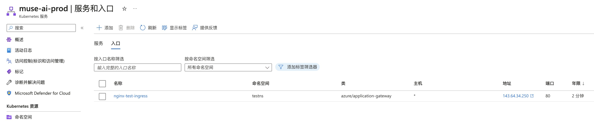

# Azure 云配置

## 初始化 az cli

```shell
az config set core.allow_broker=true
az account clear
az login
```

```shell
# 设置默认的订阅
az account set --subscription 50edd6e0-6511-42b5-9152-04ffd0040950
# 设置 active cloud 为 AzureChinaCloud
az cloud set -n AzureChinaCloud
```

## 在 Azure 上创建 k8s 集群并初始化 GPU 运行环境

### 初始化集群

**配置**
```shell
export resource_group=Muse
export resource_location=chinanorth3
export cluster_name=muse-ai-test
```

**创建资源组**

```shell
az group create \
  --name $resource_group \
  --location $resource_location
```

**创建 aks 集群**

```shell
az aks create \
    --resource-group $resource_group \
    --name $cluster_name \
    --enable-managed-identity \
    --node-count 1 \
    --outbound-type managedNATGateway \
    --nat-gateway-managed-outbound-ip-count 1 \
    --nat-gateway-idle-timeout 4
```

**获取 kubeconfig, 保存到当前目录**

```shell
az aks get-credentials \
    --resource-group $resource_group \
    --name $cluster_name \
    --file ./config-azure-$cluster_name
```

建议在 `context` 里添加一下 `namespace: default`，设置默认的 namespace，然后移动到 `~/.kube` 下

```shell
mkdir -p ~/.kube
mv ./config-azure-$cluster_name ~/.kube/
export KUBECONFIG=~/.kube/config-azure-$cluster_name
```

### 安装网络插件，创建 Application Gateway

这一步比较简单的方式是在（**设置->网络**）界面上“启用入口控制器”，这个就是 AGIC，也就是 Application Gateway Ingress Controller。


*通过命令行的方式可以参考 [启用应用程序网关](https://learn.microsoft.com/zh-cn/azure/application-gateway/tutorial-ingress-controller-add-on-existing)*


### 测试一下

**创建一个节点池用于测试，小规模实例 Standard_B2s 2vCPU 4GB**

```shell
az aks nodepool add \
    --resource-group $resource_group \
    --cluster-name $cluster_name \
    --mode User \
    --name cpupooltest \
    --node-count 1 \
    --zones 1 2 3 \
    --node-vm-size Standard_B2s \
    --os-type Linux
```

**部署 nginx**

```shell
kubectl apply -f nginx-test.yaml
```

在“服务和入口”页面可以看到 Application Gateway 的 IP，直接访问就可以看到 nginx 的默认页面了。



注意，application gateway 会做健康检查，如果 ingress 随便配置了一个 path 导致 nginx-test 服务返回 404 状态，Application Gateway 就会监听失败，返回 502

**删除**

```shell
kubectl delete namespace testns

az aks nodepool delete \
    --resource-group $resource_group \
    --cluster-name $cluster_name \
    --name cpupooltest
```

### 初始化 GPU

**创建 v100 节点池，只能选一个可用区, 不然有些类型的 PVC 无法跨区共享**

```shell
az aks nodepool add \
    --resource-group $resource_group \
    --cluster-name $cluster_name \
    --mode User \
    --name gpupool1 \
    --node-count 2 \
    --zones 1 \
    --node-vm-size Standard_NC6s_v3 \
    --node-taints sku=gpu:NoSchedule
```

**创建 CPU 节点池，用于下载和路由服务**

```shell
az aks nodepool add \
    --resource-group $resource_group \
    --cluster-name $cluster_name \
    --mode User \
    --name cpupool1 \
    --node-count 1 \
    --zones 1 \
    --node-vm-size Standard_B2s \
    --os-type Linux
```

**安装 Nvidia 插件的 DeamonSet，会在每个节点上运行一个 Pod，在节点上安装 GPU 提供所需的驱动程序**

```shell
kubectl create namespace gpu-resources
kubectl apply -f nvidia-device-plugin-ds.yaml
```

确认 GPU 可用，部署一个 Job 试一下。[确认 GPU 是可计划的](https://learn.microsoft.com/zh-cn/azure/aks/gpu-cluster#confirm-that-gpus-are-schedulable)

```shell
kubectl apply -f samples-tf-mnist-demo.yaml
```

---

## 参考资料

- https://learn.microsoft.com/zh-cn/azure/aks/learn/quick-kubernetes-deploy-cli
- https://learn.microsoft.com/zh-cn/cli/azure/aks?view=azure-cli-latest#az-aks-create
- https://learn.microsoft.com/zh-cn/azure/aks/nat-gateway
- https://learn.microsoft.com/zh-cn/azure/aks/use-multiple-node-pools
- https://learn.microsoft.com/zh-cn/azure/aks/gpu-multi-instance#run-tasks-using-kubectl
- https://learn.microsoft.com/zh-cn/azure/aks/gpu-cluster
- https://learn.microsoft.com/zh-cn/azure/aks/azure-csi-disk-storage-provision
- https://learn.microsoft.com/zh-cn/azure/application-gateway/tutorial-ingress-controller-add-on-existing
